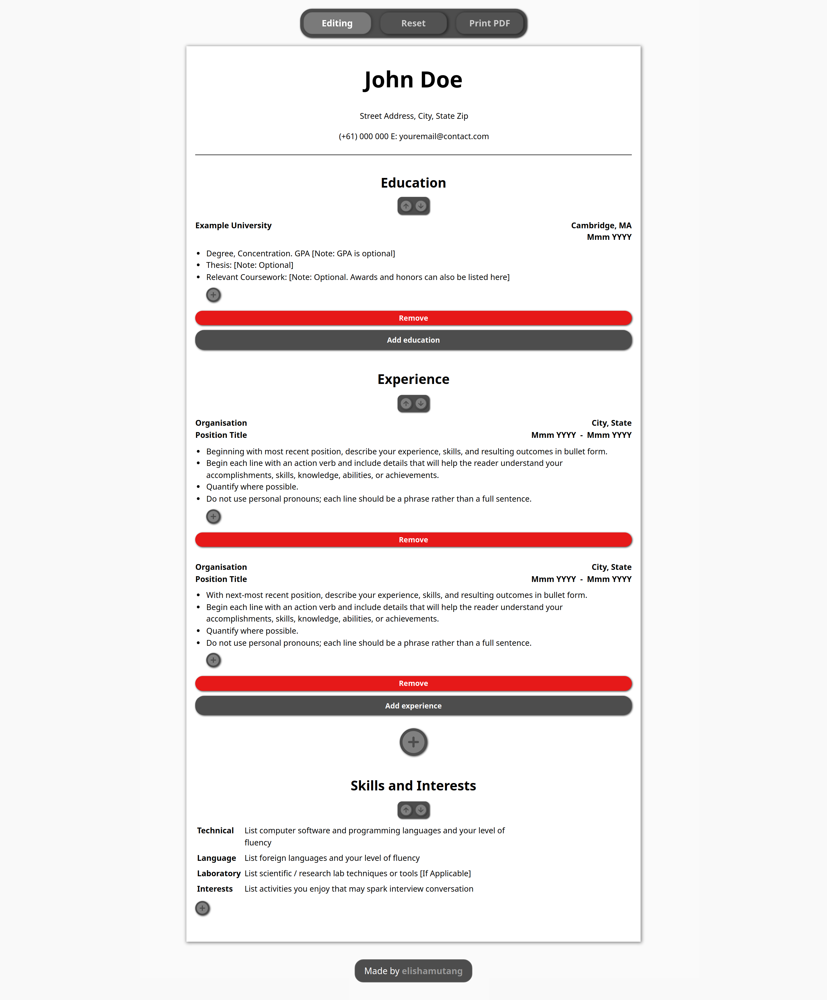
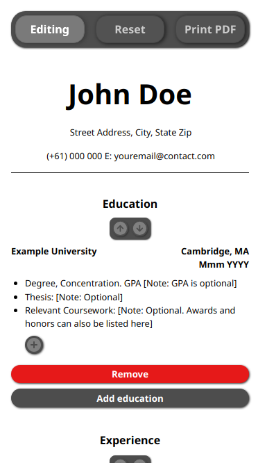
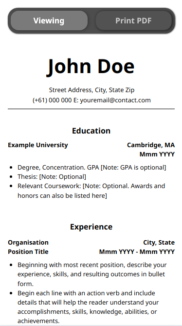

# CV Application

Developed a CV application that presents the user with a simple CV template (courtesy of [Harvard College](https://careerservices.fas.harvard.edu/resources/bullet-point-resume-template/)) to create a CV in minutes!

Main motivation to start this project was to learn React and state management using useState, and also other React Hooks such as useEffect and useRef.

## Desktop

    

## Mobile View

    
Editing

Viewing

## Additional Features

1. Viewing / Editing modes.
1. Reset to dummy values.
1. Print to PDF.

### Disclaimer

The data will remain as long as you visit the site using the _same device_ that you entered your information.
Do not fret, I cannot access any of your information. It is stored in the local storage of your device.
