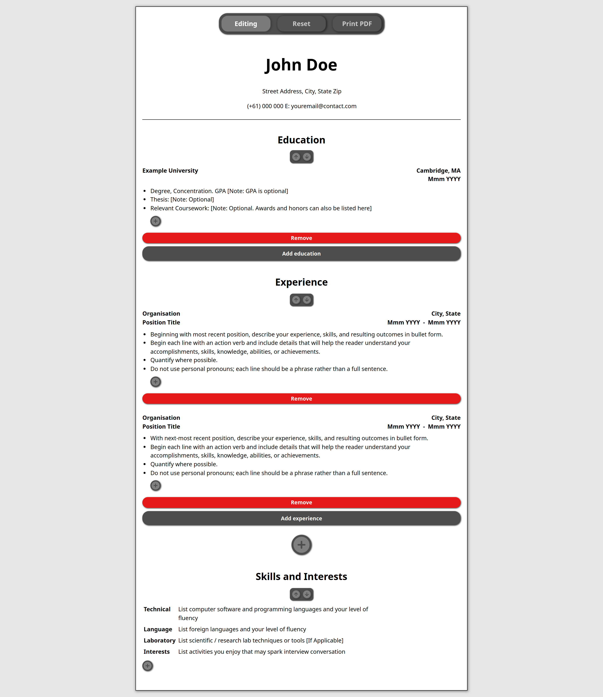

# CV Application

Currently building a CV application that presents the user with a simple CV template for users to enter their name, contact details, education, experience, projects, and any skills and interests they may have.

Main motivation to start this project was to learn a new technology, specifically the React library.

## Desktop

    

## Mobile View

Editing

    

Viewing

    

## Additional Features

1. Viewing / Editing modes.
1. Reset to dummy values.
1. Print to PDF.

### Disclaimer

The data will remain as long as you visit the site using the _same device_ that you entered your information.
Do not fret, I cannot access any of your information. It is stored in the local storage of your device.
